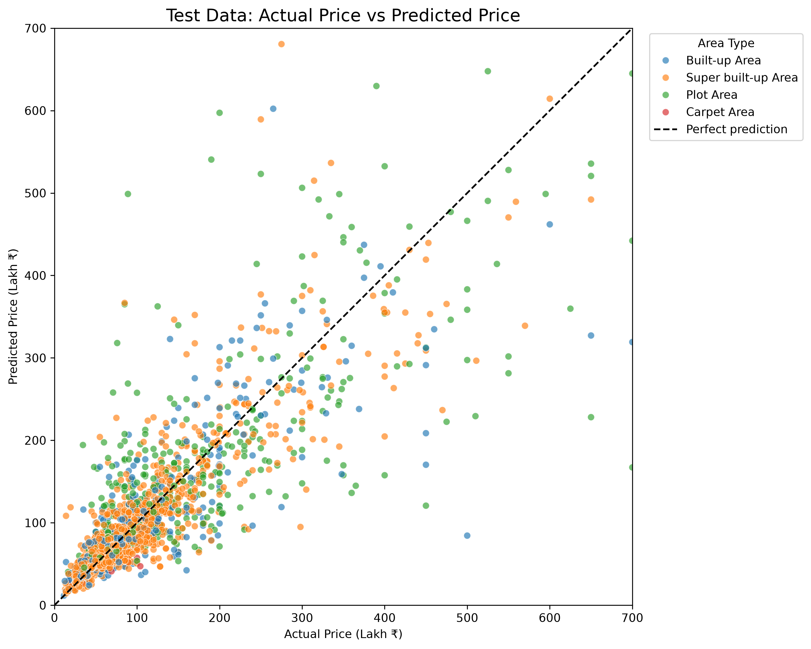
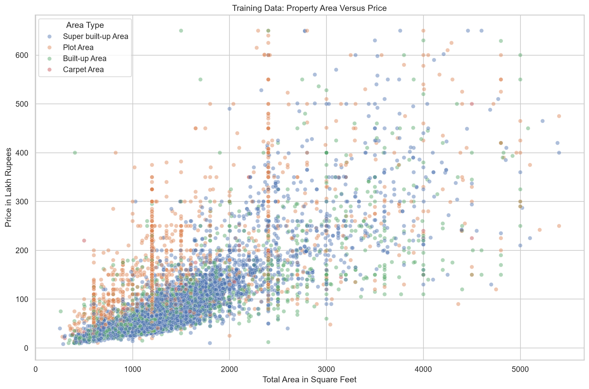
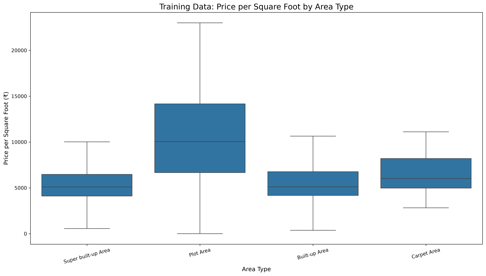

# Bengaluru Real Estate Price Prediction

An end-to-end machine-learning regression project that predicts Bengaluru property prices from location, area, bedrooms, bathrooms, balconies, property type, layout and availability.

The project covers data auditing, cleaning, exploratory analysis, outlier investigation, model comparison, hyperparameter tuning, final evaluation, model persistence and a Streamlit prediction interface.

## Project Results

The final model is a tuned Random Forest Regressor evaluated once against an untouched test dataset of 2,660 properties.

| Metric | Result |
|---|---:|
| Mean Absolute Error | ₹32.60 lakh |
| Median Absolute Error | ₹12.50 lakh |
| Root Mean Squared Error | ₹93.56 lakh |
| R² Score | 0.6483 |
| Predictions within 10% | 30.83% |
| Predictions within 20% | 56.39% |
| Predictions within 30% | 73.16% |

### Performance by Property Type

| Property type | Test records | MAE | R² |
|---|---:|---:|---:|
| Super built-up Area | 1,758 | ₹21.26 lakh | 0.75 |
| Built-up Area | 484 | ₹32.21 lakh | 0.59 |
| Carpet Area | 17 | ₹18.70 lakh | 0.35 |
| Plot Area | 401 | ₹83.39 lakh | 0.51 |

Plot Area predictions are less reliable because the source data mixes land size and constructed area.

## Model Comparison

Models were compared using five-fold cross-validation on the training dataset.

| Model | MAE | RMSE | R² |
|---|---:|---:|---:|
| Tuned Random Forest | ₹32.85 lakh | ₹92.27 lakh | 0.596 |
| Untuned Random Forest | ₹33.53 lakh | ₹93.33 lakh | 0.585 |
| Gradient Boosting | ₹34.02 lakh | ₹100.29 lakh | 0.531 |
| Ridge Regression | ₹52.68 lakh | ₹124.89 lakh | 0.272 |
| Median Baseline | ₹63.02 lakh | ₹151.84 lakh | -0.077 |

The tuned Random Forest was selected because it produced the lowest cross-validation MAE and RMSE.

## Dataset

The project uses `Bengaluru_House_Data.csv`, a dataset commonly distributed through Bengaluru house-price learning projects on Kaggle.

The dataset contains 13,320 property listings and these original columns:

- `area_type`
- `availability`
- `location`
- `size`
- `society`
- `total_sqft`
- `bath`
- `balcony`
- `price`

The raw dataset is not committed to this repository because its redistribution licence has not been confirmed.

Place a locally obtained copy at:

```text
data/raw/Bengaluru_House_Data.csv
```

## Data Preparation

The preparation process includes:

1. Auditing column types, missing values and duplicate rows.
2. Converting square-foot ranges using their midpoint.
3. Converting square metres, square yards, acres, cents, guntha, perch and grounds into square feet.
4. Extracting bedroom counts and layout types from the `size` column.
5. Standardising area type, availability and location text.
6. Removing only records with missing location, missing bedroom count or area below 100 square feet.
7. Preserving missing bathroom and balcony values for pipeline-based imputation.
8. Splitting the prepared data into training and test sets before data-dependent analysis.

After preparation:

```text
Prepared records: 13,296
Training records: 10,636
Test records: 2,660
```

## Model Features

The model uses eight input features.

### Numeric features

- Total square feet
- Bedrooms
- Bathrooms
- Balconies

### Categorical features

- Area type
- Availability
- Location
- Layout type

The saved scikit-learn pipeline performs:

- Median imputation for missing numeric values
- Missing-value indicator creation
- Numeric scaling
- Most-frequent imputation for categorical values
- One-hot encoding
- Rare-category grouping
- Random Forest prediction

`price_per_sqft` is used only for analysis. It is excluded from model inputs because it contains the target price and would cause data leakage.

## Final Model Parameters

```python
RandomForestRegressor(
    n_estimators=400,
    max_depth=20,
    min_samples_split=10,
    min_samples_leaf=1,
    max_features=1.0,
    bootstrap=True,
    random_state=42,
    n_jobs=-1,
)
```

## Actual vs Predicted Prices



The dashed diagonal represents a perfect prediction. Points farther from the line have larger prediction errors.

## Exploratory Analysis

### Area vs Price



### Price per Square Foot by Area Type



## Streamlit Application

The Streamlit application provides a browser-based form for entering:

- Location
- Total square feet
- Bedrooms
- Bathrooms
- Balconies
- Area type
- Availability
- Layout type

It loads the saved pipeline from:

```text
models/bengaluru_price_model.joblib
```

and displays the estimated price in lakh and crore rupees.

## Project Structure

```text
bengaluru-real-estate-price-prediction/
├── app.py
├── data/
│   ├── raw/
│   └── processed/
├── models/
│   └── bengaluru_price_model.joblib
├── notebooks/
├── reports/
│   ├── figures/
│   └── final_test_predictions.csv
├── src/
│   ├── 01_data_audit.py
│   ├── 02_audit_total_sqft.py
│   ├── 03_data_preparation.py
│   ├── 04_split_data.py
│   ├── 05_exploratory_analysis.py
│   ├── 06_outlier_analysis.py
│   ├── 07_model_training.py
│   ├── 08_model_tuning.py
│   ├── 09_final_evaluation.py
│   └── 10_predict.py
├── tests/
├── .gitignore
├── README.md
└── requirements.txt
```

The raw and processed CSV files are excluded from Git. The trained model is included so the Streamlit application can run without retraining.

## Installation

Clone the repository:

```bash
git clone https://github.com/shailsawant/bengaluru-real-estate-price-prediction.git
cd bengaluru-real-estate-price-prediction
```

Create a virtual environment:

```bash
python -m venv .venv
```

Activate it on Windows:

```bash
.venv\Scripts\activate
```

Install the dependencies:

```bash
python -m pip install -r requirements.txt
```

## Run the Streamlit Application

```bash
python -m streamlit run app.py
```

Open the local URL shown by Streamlit, normally:

```text
http://localhost:8501
```

## Run a Command-Line Prediction

```bash
python src/10_predict.py
```

The sample prediction uses a 1,200-square-foot, two-bedroom property in Whitefield.

## Reproduce the Training Workflow

After placing the source dataset inside `data/raw`, run:

```bash
python src/01_data_audit.py
python src/02_audit_total_sqft.py
python src/03_data_preparation.py
python src/04_split_data.py
python src/05_exploratory_analysis.py
python src/06_outlier_analysis.py
python src/07_model_training.py
python src/08_model_tuning.py
python src/09_final_evaluation.py
```

The test dataset is used only by `09_final_evaluation.py`.

## Limitations

- The source data does not contain transaction date, exact address, building age, floor, amenities or furnishing quality.
- Plot Area records behave differently from apartment records and have substantially higher prediction error.
- Rare or unseen locations receive less location-specific predictions.
- Luxury properties produce much larger errors than ordinary properties.
- The prediction is an educational estimate, not a professional property valuation.

## Technology

- Python
- pandas
- NumPy
- scikit-learn
- Matplotlib
- Seaborn
- Joblib
- Streamlit